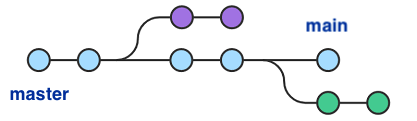
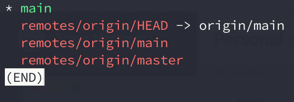
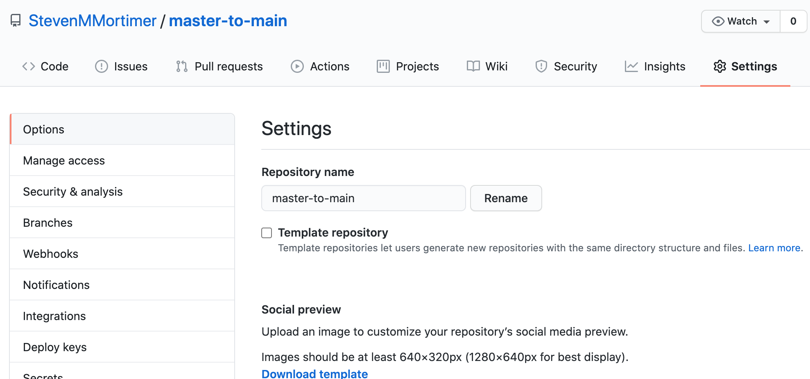
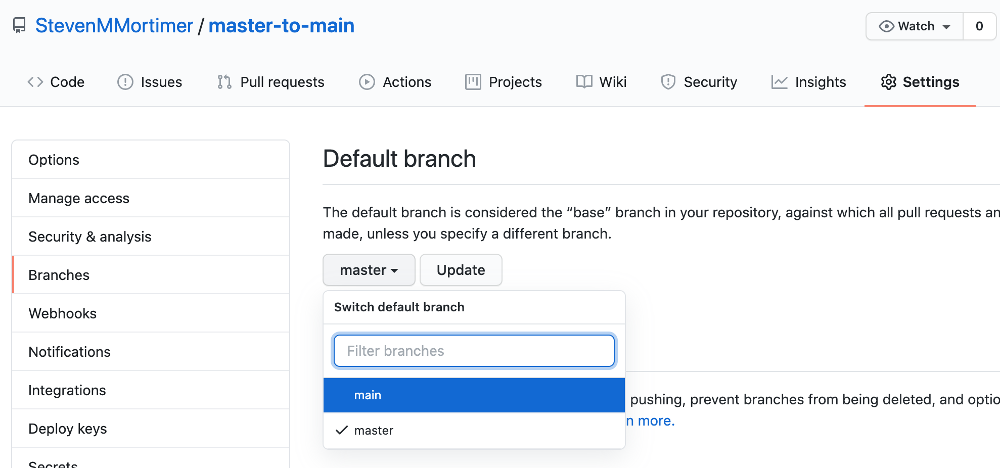
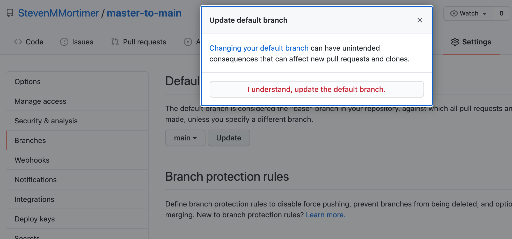
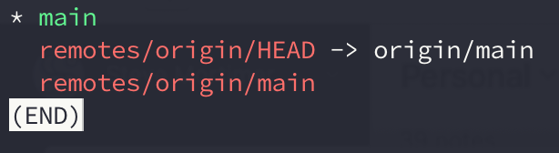

# 5步完成Git的Master到Main迁移



很长一段时间以来，Git 仓库的默认分支名一直命名为`master`。但近期，因为一些所谓的人权问题（甚至包含`master/slave`这种命名），原来的分支命名方式需要进行修改。经过讨论，Git 仓库的默认分支命名修改为`main`。

对于一些已有的仓库，可以通过以下几步操作进行默认分支的重新命名及切换。


## 更改本地分支`master`为`main`

可以通过以下命令将本地仓库的`master`分支重命名为`main`：

```bash
$ git branch -m master main
```

操作后，可以使用以下命令检查是否操作成功：

```shell
$ git status
On branch main
Your branch is up to date with 'origin/master'.

nothing to commit, working tree clean
```


## 将本地`main`分支推送至远程仓库

本地的 Git 仓库修改分支名后，远程的代码仓库（如 Github 、Gitee）并未修改，需要将本地对应的`main`分支推送至所使用的 Git 管理平台对应的仓库中，并在之后的操作中，删除原来的`master`分支。

如果设置了 up-stream 为 `origin`，可以使用以下命令推送：

```bash
$ git push -u origin main
```


## 将本地 HEAD 指向`main`分支

此时，本地 HEAD 默认指向的还是`master`分支，不能直接删除。使用以下命令，将本地仓库的 HEAD 默认指向`main`分支：

```shell
$ git symbolic-ref refs/remotes/origin/HEAD refs/remotes/origin/main
```

可以使用以下命令查询操作结果：

```bash
$ git branch -a
```




## 修改远程仓库默认分支为`main`

可以参照以下文档修改 [Github服务默认分支为main](https://docs.github.com/en/github/administering-a-repository/setting-the-default-branch)。修改路径为 "Settings" -> "Branches"：








## 删除远程仓库的`master`分支

现在，本地仓库已经不存在`master`分支，但还存在远程仓库的`master`分支指向`remotes/origin/master`。可以通过以下命令删除远程仓库的`master`分支，并清理该指向：

```bash
$ git push origin --delete master
```

- 如果设置了多个 up-stream，或其他名称的 up-stream，可以将以上命令的`origin`修改为对应的名称

以上操作步骤完成后，可以看到，本地仓库中已经没有对应的`master`分支指向（如`remotes/origin/master`）：

```bash
$ git branch -a
```




------

## 命令梳理

```bash
# 步骤一
# 本地仓库利用 master 分支创建 main 分支
$ git branch -m master main

# 步骤二
# 推送本地 main 分支至远程仓库（根据实际 up-stream 配置替换 origin）
$ git push -u origin main

# 步骤三
# 更改本地仓库默认 HEAD 指向为 main 分支
$ git symbolic-ref refs/remotes/origin/HEAD refs/remotes/origin/main

# 步骤四
# 修改远程仓库默认分支为 main
# 参考 https://docs.github.com/en/github/administering-a-repository/setting-the-default-branch

# 步骤五
# 删除远程仓库 master 分支（根据实际 up-stream 配置替换 origin）
$ git push origin --delete master
```


## 参考

- [5 steps to change GitHub default branch from master to main](https://stevenmortimer.com/5-steps-to-change-github-default-branch-from-master-to-main/)
- [How to Rename the master branch to mainin Git](https://www.git-tower.com/learn/git/faq/git-rename-master-to-main)


----

本文原始来源 [Endial Fang](https://github.com/endial) @ [Github.com](https://github.com) ([项目地址](https://github.com/endial/studylife.git))
