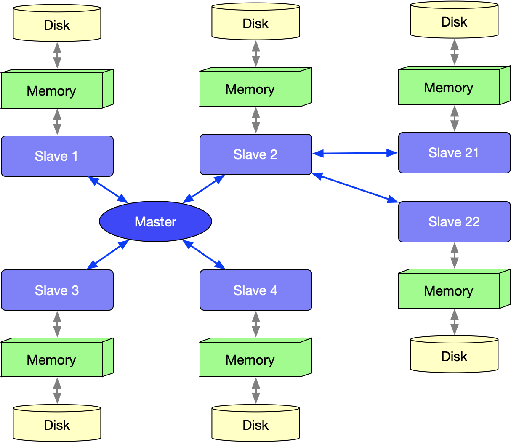
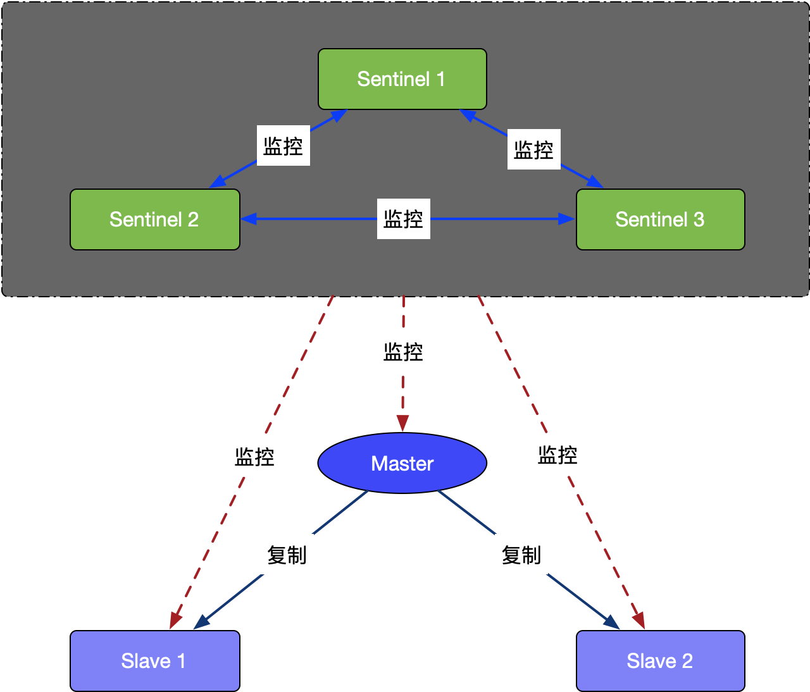
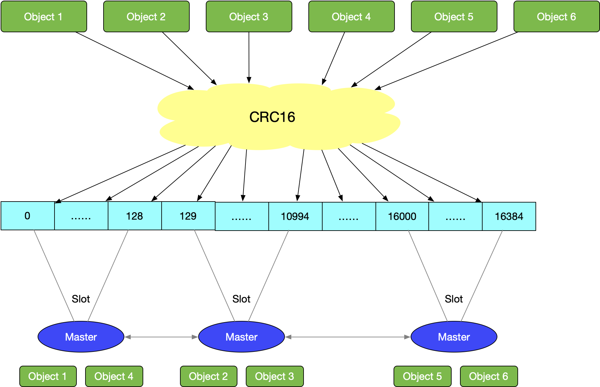
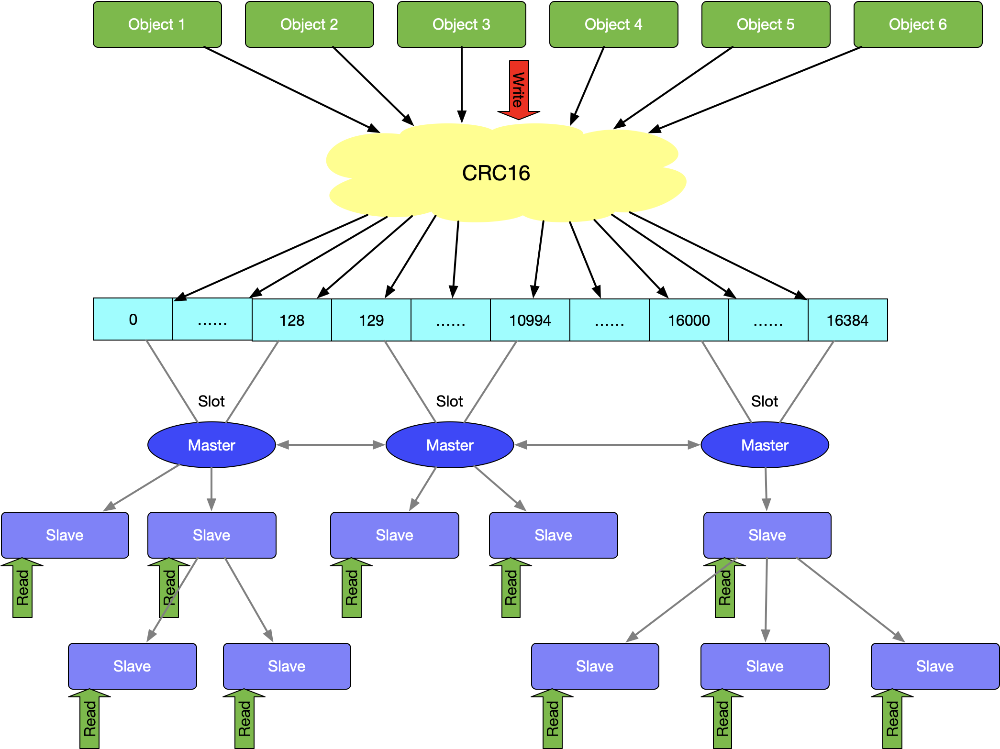

# Redis集群


## 主从复制模式

### 主从复制作用

- 数据冗余：主从复制实现了数据的热备份，是持久化之外的一种数据冗余方式。

- 故障恢复：当主节点出现问题时，可以由从节点提供服务，实现快速的故障恢复；实际上是一种服务的冗余。

- 负载均衡：在主从复制的基础上，配合读写分离，可以由主节点提供写服务，由从节点提供读服务（即写Redis数据时应用连接主节点，读Redis数据时应用连接从节点），分担服务器负载；尤其是在写少读多的场景下，通过多个从节点分担读负载，可以大大提高Redis服务器的并发量。

- 高可用基石：除了上述作用以外，主从复制还是哨兵和集群能够实施的基础，因此说主从复制是Redis高可用的基础。

  

需要注意，主从复制的开启，完全是在从节点发起的；不需要我们在主节点做任何事情。


### 主从复制特点

在主从复制中，数据库分为俩类，主数据库(master)和从数据库(slave)。其中主从复制有如下特点：

- 主数据库可以进行读写操作，当读写操作导致数据变化时会自动将数据同步给从数据库
- 从数据库一般都是只读的，并且接收主数据库同步过来的数据
- 一个master可以拥有多个slave，但是一个slave只能对应一个master



当slave启动后，主动向master发送SYNC命令。master接收到SYNC命令后在后台保存快照（RDB持久化）和缓存保存快照这段时间的命令，然后将保存的快照文件和缓存的命令发送给slave。slave接收到快照文件和命令后加载快照文件和缓存的执行命令。

复制初始化后，master每次接收到的写命令都会同步发送给slave，保证主从数据一致性。


### 优缺点

优点：读写分离，通过增加*Slaver*可以提高并发读的能力。

缺点：*Master*写能力是瓶颈。

​     虽然理论上对*Slaver*没有限制但是维护*Slaver*开销总将会变成瓶颈。

​     *Master*的*Disk*大小也将会成为整个*Redis*集群存储容量的瓶颈。


## Sentinel 哨兵



### 哨兵进程作用

哨兵的作用是监控 redis系统的运行状况，他的功能如下：

- 监控(Monitoring)：哨兵(sentinel) 会不断地检查你的 Master 和 Slave 是否运作正常。
- 提醒(Notification)：当被监控的某个Redis节点出现问题时, 哨兵(sentinel) 可以通过 API 向管理员或者其他应用程序发送通知。（使用较少）
- 自动故障迁移(Automatic failover)：当一个 Master 不能正常工作时，哨兵(sentinel) 会开始一次自动故障迁移操作。
- 多哨兵配置的时候，哨兵之间也会自动监控
- 多个哨兵可以监控同一个redis


### 哨兵工作机制

哨兵进程启动时会读取配置文件的内容，通过`sentinel monitor master-name ip port quorum`查找到master的ip端口。一个哨兵可以监控多个master数据库，只需要提供多个该配置项即可。

同事配置文件还定义了与监控相关的参数，比如master多长时间无响应即即判定位为下线。

哨兵启动后，会与要监控的master建立俩条连接：

1. 一条连接用来订阅master的`_sentinel_:hello`频道与获取其他监控该master的哨兵节点信息
2. 另一条连接定期向master发送INFO等命令获取master本身的信息


与master建立连接后，哨兵会执行三个操作，这三个操作的发送频率都可以在配置文件中配置：

1. 定期向master和slave发送INFO命令
2. 定期向master个slave的_sentinel_:hello频道发送自己的信息
3. 定期向master、slave和其他哨兵发送PING命令


这三个操作的意义非常重大，发送INFO命令可以获取当前数据库的相关信息从而实现新节点的自动发现。所以说哨兵只需要配置master数据库信息就可以自动发现其slave信息。获取到slave信息后，哨兵也会与slave建立俩条连接执行监控。通过INFO命令，哨兵可以获取主从数据库的最新信息，并进行相应的操作，比如角色变更等。

接下来哨兵向主从数据库的_sentinel_:hello频道发送信息与同样监控这些数据库的哨兵共享自己的信息，发送内容为哨兵的ip端口、运行id、配置版本、master名字、master的ip端口还有master的配置版本。这些信息有以下用处：

- 其他哨兵可以通过该信息判断发送者是否是新发现的哨兵，如果是的话会创建一个到该哨兵的连接用于发送PIN命令。
- 其他哨兵通过该信息可以判断master的版本，如果该版本高于直接记录的版本，将会更新


当实现了自动发现slave和其他哨兵节点后，哨兵就可以通过定期发送PING命令定时监控这些数据库和节点有没有停止服务。发送频率可以配置，但是最长间隔时间为1s，可以通过`sentinel down-after-milliseconds mymaster 600`设置。

如果被ping的数据库或者节点超时未回复，哨兵任务其主观下线。如果下线的是master，哨兵会向其他哨兵点发送命令询问他们是否也认为该master主观下线，如果达到一定数目（即配置文件中的`quorum`）投票，哨兵会认为该master已经客观下线，并选举领头的哨兵节点对主从系统发起故障恢复。

如上文所说，哨兵认为master客观下线后，故障恢复的操作需要由选举的领头哨兵执行，选举采用Raft算法：

1. 发现master下线的哨兵节点（我们称他为A）向每个哨兵发送命令，要求对方选自己为领头哨兵
2. 如果目标哨兵节点没有选过其他人，则会同意选举A为领头哨兵
3. 如果有超过一半的哨兵同意选举A为领头，则A当选
4. 如果有多个哨兵节点同时参选领头，此时有可能存在一轮投票无竞选者胜出，此时每个参选的节点等待一个随机时间后再次发起参选请求，进行下一轮投票精选，直至选举出领头哨兵


选出领头哨兵后，领头者开始对进行故障恢复，从出现故障的master的从数据库中挑选一个来当选新的master,选择规则如下：

1. 所有在线的slave中选择优先级最高的，优先级可以通过`slave-priority`配置
2. 如果有多个最高优先级的slave，则选取复制偏移量最大（即复制越完整）的当选
3. 如果以上条件都一样，选取id最小的slave


挑选出需要继任的slaver后，领头哨兵向该数据库发送命令使其升格为master，然后再向其他slave发送命令接受新的master，最后更新数据。将已经停止的旧的master更新为新的master的从数据库，使其恢复服务后以slave的身份继续运行。

配置举例：

```shell
port 26381
daemonize yes
pidfile "/var/run/redis-sentinel.pid"
# 1.配置主节点 ip; 2.配置2个哨兵节点同意即升级为主节点
sentinel monitor mymaster 172.16.1.105 6379 2
sentinel config-epoch mymaster 18
```


## Redis-Cluster 集群

使用集群，只需要将每个数据库节点的cluster-enable配置打开即可。每个集群中至少需要三个主数据库才能正常运行。




### 概念

- 由多个Redis服务器组成的分布式网络服务集群；
- 集群之中有多个Master主节点，每一个主节点都可读可写；
- 节点之间会互相通信，两两相连；
- Redis集群无中心节点。


### 集群节点复制

- 在Redis-Cluster集群中，可以给每一个主节点添加从节点，主节点和从节点直接遵循主从模型的特性。

- 当用户需要处理更多读请求的时候，添加从节点可以扩展系统的读性能。

  

### 故障转移

- Redis集群的主节点内置了类似Redis Sentinel的节点故障检测和自动故障转移功能，当集群中的某个主节点下线时，集群中的其他在线主节点会注意到这一点，并对已下线的主节点进行故障转移。
- 集群进行故障转移的方法和Redis Sentinel进行故障转移的方法基本一样，不同的是，在集群里面，故障转移是由集群中其他在线的主节点负责进行的，所以集群不必另外使用Redis Sentinel。
集群分片策略


### 集群分片策略

- Redis-cluster分片策略，是用来解决key存储位置的。
- 集群将整个数据库分为16384个槽位slot，所有key-value数据都存储在这些slot中的某一个上。一个slot槽位可以存放多个数据，key的槽位计算公式为：slot_number=crc16(key)%16384，其中crc16为16位的循环冗余校验和函数。
- 集群中的每个主节点都可以处理0个至16383个槽，当16384个槽都有某个节点在负责处理时，集群进入上线状态，并开始处理客户端发送的数据命令请求。
  

### 集群Redirect转向

- 由于Redis集群无中心节点，请求会随机发给任意主节点；
- 主节点只会处理自己负责槽位的命令请求，其它槽位的命令请求，该主节点会返回客户端一个转向错误；
- 客户端根据错误中包含的地址和端口重新向正确的负责的主节点发起命令请求。


### redis-cluster集群配置

```shell
port 6384
cluster-enabled yes
cluster-config-file nodes-6384.conf
cluster-node-timeout 15000
pidfile “/var/run/redis_6384.pid”
```


### 问题解决

#### Node xxx is not empty

问题：

```shell
Node XXXXX is not empty. Either the node already knows other nodes (check with CLUSTER NODES) or contains some key in database 0.
```


解决：

**分别删除appendonly.aof dump.rdb nodes.conf，或者查看是否配置的aof rdb文件是否存放在一个文件夹里面文件命名冲突了。**


#### waiting for the cluster to join

问题：

```shell
redis cluster 一直在等待 Waiting for the cluster to join
```


解决：

1. 是端口号+10000 的端口没有打开 例如6379 为16379 为集群端口
2. 是需要在集群里输入 cluster meet 127.0.0.1 7000
3. 是绑定ip顺序，如果绑定两个ip ，要通过将绑定ip 127.0.0.1 放置到后面实现的。


### 优缺点

缺点：每个*Node*承担着互相监听、高并发数据写入、高并发数据读出，工作任务繁重

优点：将*Redis*的写操作分摊到了多个节点上，提高写的并发能力，扩容简单。


## Cluster与主从复合




### 优缺点

优点：

- 想扩展并发读就添加*Slaver*，想扩展并发写就添加*Master*，想扩容也就是添加*Master*
- 任何一个*Slaver*或者几个*Master*挂了都不会是灾难性的故障

缺点：

- 部署稍微复杂点


## 参考

- [集群搭建详解](https://www.toutiao.com/a6807653203312640524/?tt_from=weixin&utm_campaign=client_share&wxshare_count=1&timestamp=1585269481&app=news_article&utm_source=weixin&utm_medium=toutiao_ios&req_id=20200327083801010014041161299B1B21&group_id=6807653203312640524)

  

----

本文原始来源 [Endial Fang](https://github.com/endial) @ [Github.com](https://github.com) ([项目地址](https://github.com/endial/studylife.git))

