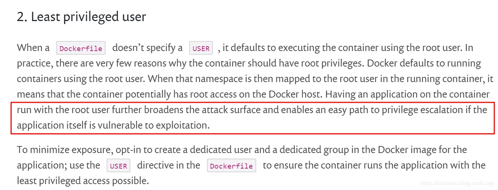
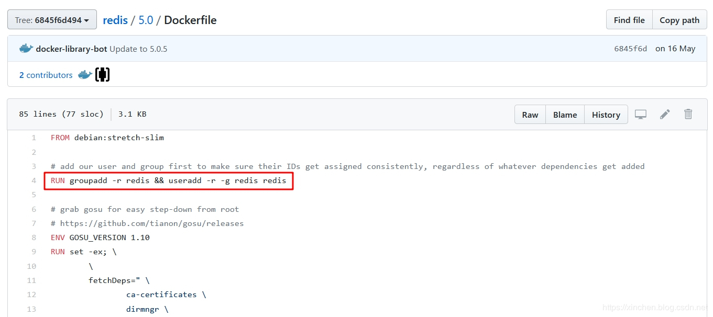
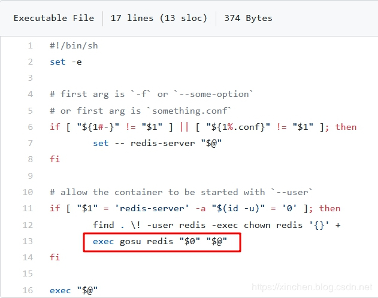
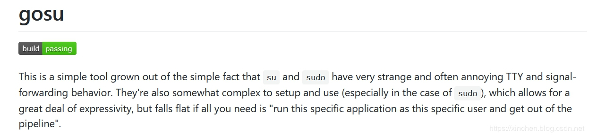
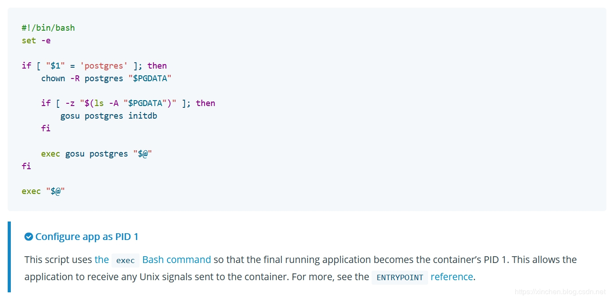
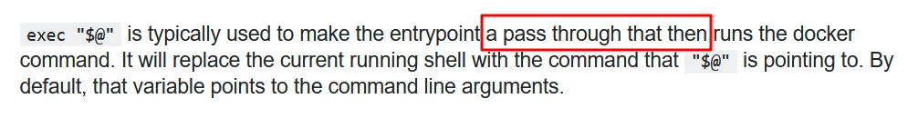

# 简述

gosu是个工具，用来提升指定账号的权限，作用与sudo命令类似，而docker中使用gosu的起源来自安全问题。

docker容器中运行的进程，如果以root身份运行的会有安全隐患，该进程拥有容器内的全部权限，更可怕的是如果有数据卷映射到宿主机，那么通过该容器就能操作宿主机的文件夹了，一旦该容器的进程有漏洞被外部利用后果是很严重的。

因此，容器内使用非root账号运行进程才是安全的方式，这也是我们在制作镜像时要注意的地方。推荐在容器中使用最小权限的账号：https://snyk.io/blog/10-docker-image-security-best-practices/ ，如下图：




## 在镜像中创建非root账号

既然不能用root账号，那就要创建其他账号来运行进程了，以redis官方镜像的Dockerfile为例，来看看如何创建账号，地址是：https://github.com/docker-library/redis/blob/6845f6d4940f94c50a9f1bf16e07058d0fe4bc4f/5.0/Dockerfile ，如下图：



可见redis官方镜像使用`groupadd`和`useradd`创建了名为`redis`的组合账号，接下来就是用`redis`账号来启动服务了，理论上应该是以下套路：

- 用USER redis将账号切换到redis；
- 在docker-entrypoint.sh执行的时候已经是redis身份了，如果遇到权限问题，例如一些文件只有root账号有读、写、执行权限，用sudo xxx命令来执行即可；
  

但事实并非如此！

在Dockerfile脚本中未发现`USER redis`命令，这意味着执行docker-entrypoint.sh文件的身份是root；
其次，在docker-entrypoint.sh中没有发现`su - redis`命令，也没有sudo命令；

这是怎么回事呢？难道容器内的redis服务是用root账号启动的？


## 确认redis服务的启动账号

还是自己动手来证实一下吧，我的环境信息如下：

- 操作系统：CentOS Linux release 7.6.1810
- Docker： 19.03.8


操作步骤如下：

1. 启动一个redis容器：

   ```shell
   docker run --name myredis -idt redis
   ```

2. 进入容器：

   ```shell
   docker exec -it myredis /bin/bash
   ```

3. 在容器内，先更新apt，然后安装ps命令：

   ```shell
   apt-get update
   apt-get install procps
   ```

4. 执行命令ps -ef查看redis服务，结果如下：

   ```shell
   root@122c2df16bbb:/data# ps -ef
   UID         PID   PPID  C STIME TTY          TIME CMD
   redis         1      0  0 09:22 ?        00:00:01 redis-server *:6379
   root        287      0  0 09:36 ?        00:00:00 /bin/bash
   root        293    287  0 09:39 ?        00:00:00 ps -ef
   ```

上面的结果展示了两个关键信息：

1. redis服务是redis账号启动的，并非root；
2. redis服务的PID等于1，这很重要，宿主机执行docker stop命令时，该进程可以收到SIGTERM信号量，于是redis应用可以做一些退出前的准备工作，例如保存变量、退出循环等，也就是优雅停机(Gracefully Stopping)；

现在我们已经证实了redis服务并非root账号启动，而且该服务进程在容器内还是一号进程，但是我们在Dockerfile和docker-entrypoint.sh脚本中都没有发现切换到redis账号的命令，也没有sudo和su，这是怎么回事呢？

**答案是gosu**

再看一次redis的docker-entrypoint.sh文件，地址是：https://github.com/docker-library/redis/blob/6845f6d4940f94c50a9f1bf16e07058d0fe4bc4f/5.0/docker-entrypoint.sh，如下图：




注意上图中的代码，我们来分析一下：

1. 假设启动容器的命令是docker run --name myredis -idt redis redis-server /usr/local/etc/redis/redis.conf；

2. 容器启动后会执行docker-entrypoint.sh脚本，此时的账号是root；

3. 当前账号是root，因此会执行上图红框中的逻辑；

4. 红框中的$0表示当前脚本的名称,即docker-entrypoint.sh；

5. 红框中的$@表示外部传入的所有参数，即redis-server /usr/local/etc/redis/redis.conf；

6. gosu redis “$0” “@”，表示以redis账号的身份执行以下命令：

   ```shell
   docker-entrypoint.sh redis-server /usr/local/etc/redis/redis.conf
   ```

7. gosu redis “$0” "@"前面加上个exec，表示以gosu redis “$0” "@"这个命令启动的进程替换正在执行的docker-entrypoint.sh进程，这样就保证了gosu redis “$0” "@"对应的进程ID为1；

8. gosu redis “$0” "@"导致docker-entrypoint.sh再执行一次，但是当前的账号已经不是root了，于是会执行兜底逻辑 exec “$@”；

9. 此时的$@是redis-server /usr/local/etc/redis/redis.conf，因此redis服务会启动，而且账号是redis；

10. $@前面有个exec，会用redis-server命令启动的进程取代当前的docker-entrypoint.sh进程，所以，最终redis进程的PID等于1，而docker-entrypoint.sh这个脚本的进程已经被替代，因此就结束掉了；


## 关于gosu


通过上面的分析，我们对gosu的作用有了基本了解：功能和sudo类似，提升指定账号的权限，用来执行指定的命令，其官网地址是：https://github.com/tianon/gosu ，如下图所示，官方的描述也是说su和sudo命令有一些问题，所以才有了gosu工具来作为替代品：



在docker的官方文档中，也见到了gosu的使用示例，和前面的redis很像，地址是：https://docs.docker.com/develop/develop-images/dockerfile_best-practices/，如下图：



注意上图中底部的那段话：使用exec XXX命令以确保XXX对应的进程的PID保持为1，这样该进程才能收到宿主机发送给容器的信号量；


## 为什么要用gosu取代sudo

前面主要讲gosu的用法，但是为什么要用gosu呢？接下来通过实战对比来看看sudo的问题在哪：

1、执行以下命令创建一个容器：

```shell
docker run --rm gosu/alpine gosu root ps aux
```

上述命令会启动一个安装了gosu的linux容器，并且启动后自动执行命令gosu root ps aux，作用是以root账号的身份执行ps aux，也就是将当前进程都打印出来，执行结果如下：

```shell
[root@centos7 ~]# docker run --rm gosu/alpine gosu root ps aux
PID   USER     TIME  COMMAND
    1 root      0:00 ps aux
```

上述信息显示，我们执行docker run时的gosu root ps aux会执行ps命令，该命令成了容器内的唯一进程，这说明通过gosu启动的是符合我们要求的（PID为1），接下来再看看用sudo执行ps命令的效果；


2、执行以下命令创建一个容器：

```shell
docker run --rm ubuntu:trusty sudo ps aux
```

上述命令会用sudo启动ps命令，结果如下：

```shell
USER        PID %CPU %MEM    VSZ   RSS TTY      STAT START   TIME COMMAND
root          1  0.0  0.0  46012  1772 ?        Rs   12:05   0:00 sudo ps aux
root          6  0.0  0.0  15568  1140 ?        R    12:05   0:00 ps aux
```

尽管我们只想启动ps进程，但是容器内出现了两个进程，sudo命令会创建第一个进程，然后该进程再创建了ps进程，而且ps进程的PID并不等于1，这是达不到我们要求的，此时在宿主机向该容器发送信号量，收到信号量的是sudo进程。


3、通过上面对可以小结:

1. gosu启动命令时只有一个进程，所以docker容器启动时使用gosu，那么该进程可以做到PID等于1；
2. sudo启动命令时先创建sudo进程，然后该进程作为父进程去创建子进程，1号PID被sudo进程占据；
   

**综上所述，在docker的entrypoint中有如下建议：**

1. 创建group和普通账号，不要使用root账号启动进程；
2. 如果普通账号权限不够用，建议使用gosu来提升权限，而不是sudo；
3. entrypoint.sh脚本在执行的时候也是个进程，启动业务进程的时候，在命令前面加上exec，这样新的进程就会取代entrypoint.sh的进程，得到1号PID；
4. exec "$@"是个保底的逻辑，如果entrypoint.sh的入参在整个脚本中都没有被执行，那么exec "$@"会把入参执行一遍，如果前面执行过了，这一行就不起作用，这个命令的细节在Stack Overflow上有详细的描述，地址是：https://stackoverflow.com/questions/39082768/what-does-set-e-and-exec-do-for-docker-entrypoint-scripts，如下图：




## 如何在镜像中安装gosu

前面的redis例子中，我们看到docker-entrypoint.sh中用到了gosu，那么是在哪里安装了gosu呢？自然是Dockerfile中，一起来看看redis的Dockerfile中是如何安装gosu的：

```dockerfile
# grab gosu for easy step-down from root

# https://github.com/tianon/gosu/releases

ENV GOSU_VERSION 1.11
RUN set -ex; \
	\
	fetchDeps=" \
		ca-certificates \
		dirmngr \
		gnupg \
		wget \
	"; \
	apt-get update; \
	apt-get install -y --no-install-recommends $fetchDeps; \
	rm -rf /var/lib/apt/lists/*; \
	\
	dpkgArch="$(dpkg --print-architecture | awk -F- '{ print $NF }')"; \
	wget -O /usr/local/bin/gosu "https://github.com/tianon/gosu/releases/download/$GOSU_VERSION/gosu-$dpkgArch"; \
	wget -O /usr/local/bin/gosu.asc "https://github.com/tianon/gosu/releases/download/$GOSU_VERSION/gosu-$dpkgArch.asc"; \
	export GNUPGHOME="$(mktemp -d)"; \
	gpg --batch --keyserver ha.pool.sks-keyservers.net --recv-keys B42F6819007F00F88E364FD4036A9C25BF357DD4; \
	gpg --batch --verify /usr/local/bin/gosu.asc /usr/local/bin/gosu; \
	gpgconf --kill all; \
	rm -r "$GNUPGHOME" /usr/local/bin/gosu.asc; \
	chmod +x /usr/local/bin/gosu; \
	gosu nobody true; \
	\
	apt-get purge -y --auto-remove $fetchDeps
```


至此，gosu在docker中的作用已经分析完毕，希望在您编写自定义镜像的时候，本文能给您带来一些参考。


## 参考

- https://snyk.io/blog/10-docker-image-security-best-practices/


----

本文原始来源 [Endial Fang](https://github.com/endial) @ [Github.com](https://github.com) ([项目地址](https://github.com/endial/studylife.git))
