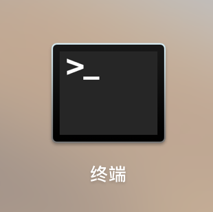
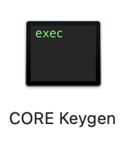
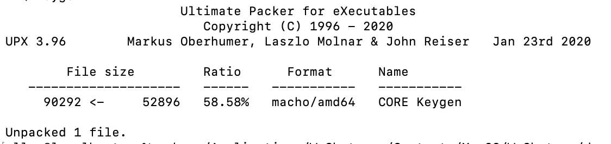
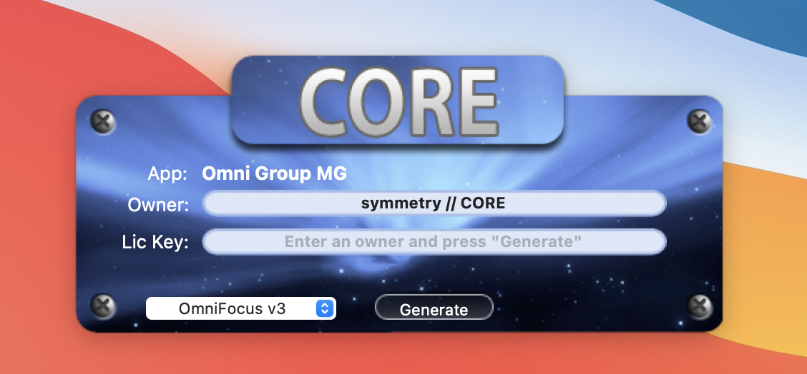

# 解决MacOS下程序无法打开或已损坏问题


## 打开终端(terminal)

终端在应用程序-实用工具内，或者打开其动态-其他，终端长这样：



然后复制粘贴下面的内容：

```
sudo spctl --master-disable
```

会出现Password：的提示，这个时候你输入自己的密码（密码不会有星号提示），然后回车。

搞定！

当然如果你很在意安全性，你可以打开软件后，再次打开终端，输入：

```
sudo spctl --master-enable
```

这样就把苹果的应用安全保护功能又打开了。

如果还是不行，可以去除这个应用的安全隔离属性，操作如下：

1. 打开终端（Terminal），输入以下命令后回车，如需要，请输入密码

   ```
   xattr -r -d com.apple.quarantine <path>
   ```

   是你下载的应用程序的路径，一般在/Applications/应用程序名字，比较简单的方式，就是复制“xattr -r -d com.apple.quarantine”，加个空格，然后把程序直接拖到终端里，这样就终端就自动显示文件路径和名称了。

然后再打开软件就可以了

例如（sketch可以写为）：

```
xattr -r -d com.apple.quarantine /Applications/Sketch.app
```

PDF Expert可写为：

```
xattr -r -d com.apple.quarantine /Applications/PDF\ Expert.app
```

Alfred4可写为：

```
sudo xattr -rd com.apple.quarantine /Applications/Alfred\ 4.app
```


## 解决MacOS 11 Big Sur 下“您没有权限来打开应用程序”的问题

第1. 如果没有安装homebrew，可以先安装homebrew

第2. 通过homebrew安装免费开源的应用程序：UPX

```
brew install upx
```

第3. 找到你要打开的app软件，右键-显示包内容-打开Contents文件夹-打开MacOS文件夹-找到和app的同名文件，比如我的是“Core Keygen”



第4. 打开终端，输入代码:"sudo upx -d "，然后把那个文件拖到终端，那个文件的路径自动就加进去了，比如我的是

```
sudo upx -d /Applications/CORE\ Keygen.app/Contents/MacOS/CORE\ Keygen
```

第5. 输入电脑密码，回车，下面解包成功的提示，就可以直接打开软件了






## 参考

- [如何处理Mac软件没权限已损坏打不开您应该将它移到废纸篓？](https://qiujunya.com/article/2019/6/15/5.html)


----

本文原始来源 [Endial Fang](https://github.com/endial) @ [Github.com](https://github.com) ([项目地址](https://github.com/endial/studylife.git))
