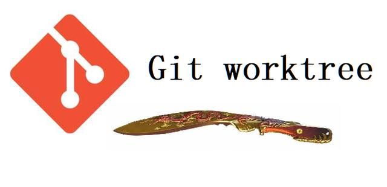
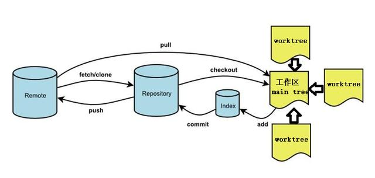

# Git Worktree's

在开发工作中，大家估计都遇到过这样的需求：正在开发的东西不想动，但是需要一个完整工作目录来做测试或者搞一些其他事情。一般来说可以拉个分支，用`git stash`保存目前的工作区状态，等搞完事情再切回来。但是如果需要两个或者更多个工作区同时搞事情上面的方案就不行。这时候当然可以`git clone`几个完整仓库副本来搞，但是也很麻烦费事，而且仓库的同步也是个问题。有没有更好的方法呢？这就可以请出 Git 的 Worktrees 工作树功能啦。




## 概述

Git worktree 严格意义上说已经不是一个新的功能了，它推出也已经好几年了，是在 2015 年 7 月发布的 2.5 版引入的。Worktree 是链接到统一仓库的多个工作区（目录，树）。一个 Git 仓库可以支持多个工作树，分别对应不同的分支。我们在 Git 中通过`git init`或`git clone`创建一个（主）工作区（树）（main working tree）。

同理，我们使用`git worktree`创建一个（和工作区）不同目录的工作区（树），我们称之为为"链接工作区（树）（linked working tree）"。Git 仓库有一个主工作树（裸库）和零个或多个链接工作树。与重建的孤立的目录不同，链接工作树和主仓库直接就行分支一样是有机关联的，任何一个链接工作树的变更提交都在仓库内部。链接工作树用完后，可以直接通过`git worktree remove`删除。




## 基本用法

```shell
$ git worktree add [<选项>] <工作区路径> <分支>[<提交>]
$ git worktree list [<选项>]
$ git worktree lock [<选项>] <工作区路径>
$ git worktree move <工作区路径> <新路径>
$ git worktree prune [<选项>]
$ git worktree remove [<选项>] <工作区路径>
$ git worktree unlock <工作区路径>
```


### add

工作树的创建和创建新分支一样简单而高效。运行下面的格式创建工作树：

`git worktree add ../工作树目录 分支(commits ID)`

该命令就会在`../`工作树目录下，创建一套完整分支工作区。该目录可以任意指定，但是最好在主仓库目录之外，免得污染仓库。然后就可以在该目录下检出分支，向上游推送，等等。

如果分支不存在，则可以用`-b`操作，可以新建分支并使这个新分支关联到工作树。

### list

`list`功能会列出每个工作树的详细信息。首先列出主工作树，然后列出每个链接工作树。输出详细信息包括工作树是否为裸树，工作树对应`git commit`哈希以及对应的分支（如果没有，则为分离的`HEAD`）。

`list`功能有一个`--porcelain`选项，可以列出更完整的哈希值和分支信息

### lock

如果工作树目录位于便携式设备或网络共享上，请使用`lock`对其进行锁定，以防止其管理文件被自动删除。这也可以防止其被移动或删除。

### move

将工作树移动到新目录。请注意，不能移动包含子模块的主工作树或链接的工作树。比如我们执行：

`git worktree move alpha ../a`

### prune

清除`$GIT_DIR/worktrees`中的工作树信息。

### remove

前面提到过，用户删除工作树。注意：该命令只能删除干净的工作树（没有未跟踪的文件，也无法对跟踪的文件进行任何修改）。不干净的工作树或带有子模块的树需要使用`--force`删除。主工作树无法删除。

### unlock

对锁定工作中的树，解锁，解锁后就可以对其进行`prune`、`move`或者`remove`等操作。


## 工作树的作用

那么用工作树可以做什么事情呢？这儿就介绍介绍工作树的相关应用场景。

### 在另一个分支上工作时运行测试

在具有非常好的测试覆盖范围的大型项目中，运行某组测试套件可能需要很长时间，与其浪费时间死等，不如多拉几个工作树并行运行多个测试套件。许多`IDE`都允许一次打开多个项目，但每个项目必须位于自己的目录中。我们可以`git`克隆两个完全独立的存储库，但是工作树更完美：

- 工作树是使用硬链接实现的，因此它们既轻巧又快速。

- 可以在工作树之间共享更改（只要它们将其提交到本地存储库）。对于克隆，必须先推送到远程库，在`git pull`来同步。

如果不小心`clone`的副本提交错误的提交了变化，则必须手工（如果很简单）或使用修补程序迁移变更。而使用工作树，只需要使用`git cherry-pick`和`git reset`即可修复错误。

通常做法是为运行测试保留一个额外的工作树。但是工作树有一个限制就是一个分支只能拉一个工作树。可以通过创建临时分支来解决这个问题，如下所示：

`git checkout -b TEMP/branch feature/branch`

此处使用`TEMP`前缀来强调该分支是临时的。当在原始分支上提交更改时，可以方便的使用`git merge feature/branch`同步分支。

### 比较多个版本

有时，需要比较一个项目的某两个版本，但仅用`diff`无法做得到。可能需要同拉两个版本逐个比对，甚至需要同时运行两个版本。或者一个复杂的功能恰好写了一半，无法确定从哪个地方做标记对比，这时可以通过先前的版本或者任何`commit`提交来拉工作树做对比操作。

### 在其他分支上工作，而不会影响当前的工作副本

也许我们需要在其他分支上工作，但是当前的工作目录混乱不堪，也无法使用`git stash`来保存状态。根据项目的不同，切换分支有可能还会产生不良的副作用（例如，导致`IDE`重新生成索引）。这时候就只能使用工作树来解决。

### 使用工作树快速验证项目

每个人都可能遇到过构建失败的经历，可能是因为你搭档忘记提交一些必须的配置或`.gitgnore`设置的太宽泛了等等。而代码可以很好的在它的电脑上运行，到你这就挂了，则可能是由于可能缺少某些文件。这时候就可以使用工作树拉一个干净的副本做测试验证所有需要包含都已经添加了。只有从创建新工作树开始，才能可靠地工作。


## 工作树的限制

### 不能多个工作树对应同一个分支

这是工作树的一个本身限制；如果需要针对一个分支建立多个工作树进行操作，可以针对该分支建立一个临时分支，在建立工作树就可以了。

### 不适用于子模块

目前使用子模块的存储库无法利用工作树。


## 参考

- [鲜为人知的Git功能——Git Worktree工作树](https://www.toutiao.com/i6759396858965017102/?tt_from=weixin&utm_campaign=client_share&wxshare_count=1&timestamp=1595034346&app=news_article&utm_source=weixin&utm_medium=toutiao_ios&use_new_style=1&req_id=20200718090545010014048140278ABCAE&group_id=6759396858965017102)


----

本文原始来源 [Endial Fang](https://github.com/endial) @ [Github.com](https://github.com) ([项目地址](https://github.com/endial/studylife.git))

