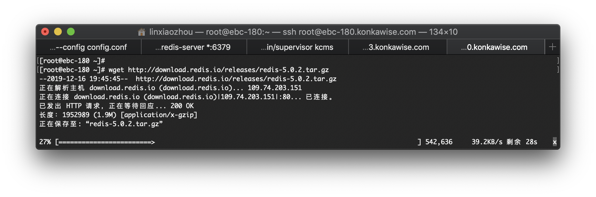
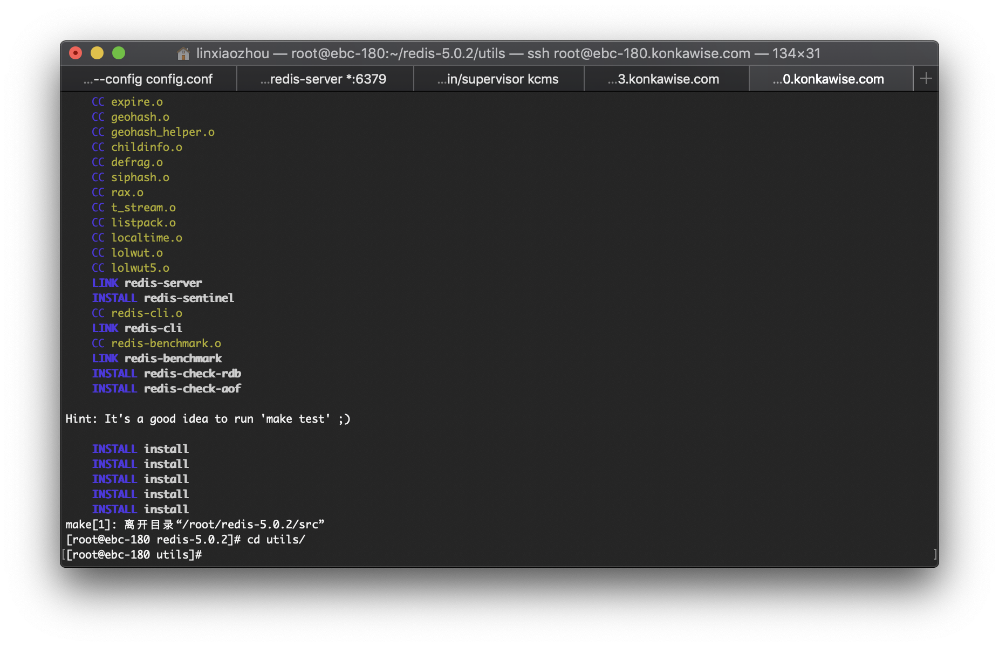
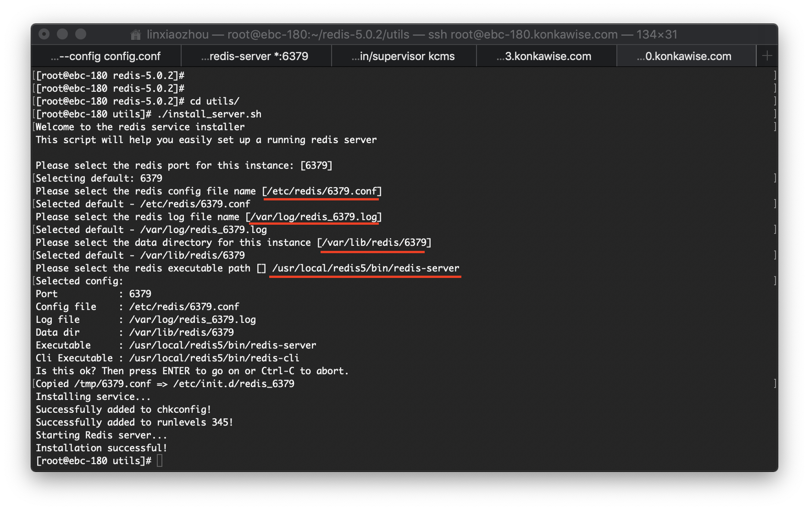
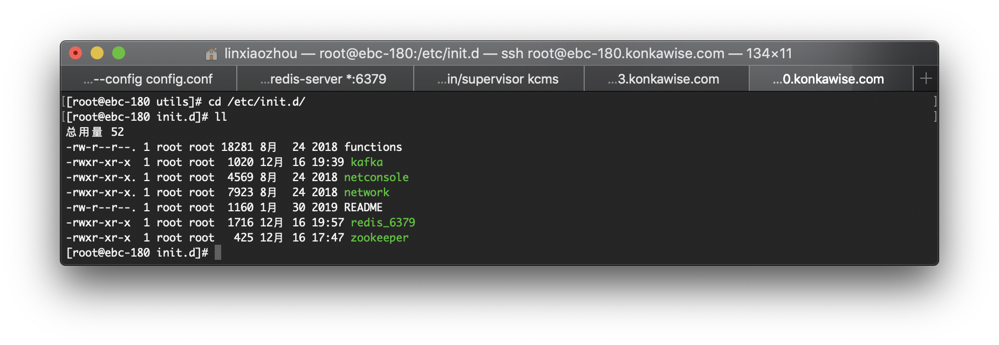
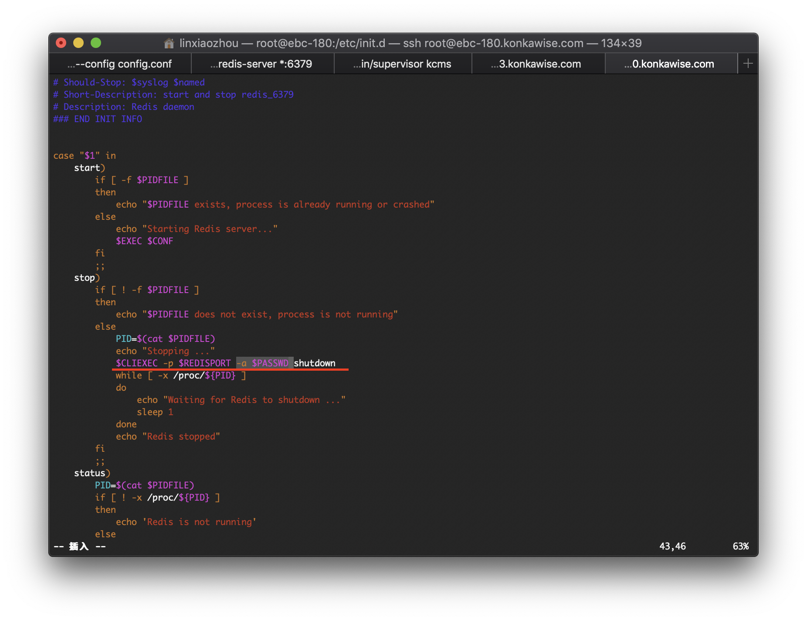
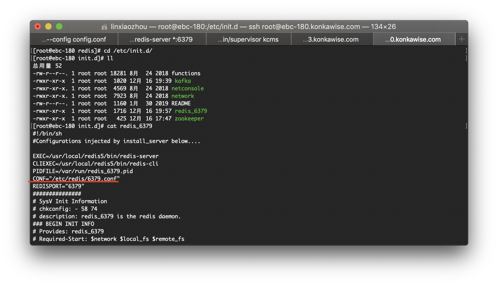
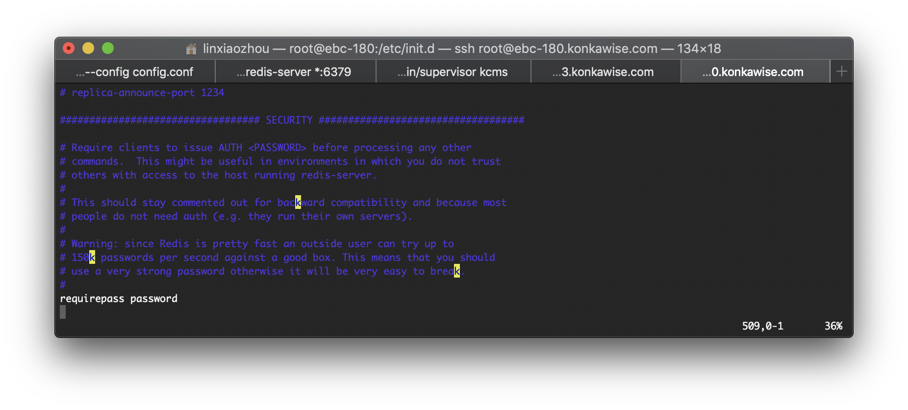
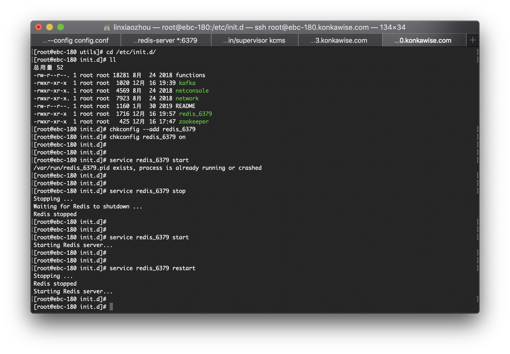

# Redis简介


## Redis安装

### 下载及解压

进入root用户目录，下载redis：

```
wget http://download.redis.io/releases/redis-5.0.2.tar.gz
```




解压redis安装包到当前目录：

```
tar -xvzf redis-5.0.2.tar.gz
```


### 安装&配置

进入解压后的目录，编译：

```
cd redis-5.0.2

# 编译
make PREFIX=/usr/local/redis5 install
```



配置及编译过程中，如果遇到错误，可参见[问题解决](#问题解决)章节。


编译通过后，安装：

```
cd redis-5.0.2/utils

# 安装redis服务
./install_server.sh
```

安装过程中，需要输入一些信息（如果使用默认信息，直接按回车即可）：

| 问题                                               | 输入                                                  |
| :------------------------------------------------- | :---------------------------------------------------- |
| Please select the redis port for this instance     | 使用默认端口号`6379`                                  |
| Please select the redis config file name           | 使用默认路径 `/etc/redis/6379.conf`                   |
| Please select the redis log file name              | 使用默认路径 `/var/log/redis_6379.log`                |
| Please select the data directory for this instance | 使用默认路径 `/var/lib/redis/6379`                    |
| Please select the redis executable path            | 手动输入指定路径 `/usr/local/redis5/bin/redis-server` |




### 开机自启

执行以上步骤后会生成 `/etc/init.d/redis_6379` 这个脚本，不需要自行创建。


打开该文件，将以下代码：

```
$CLIEXEC -p $REDISPORT  shutdown
```

修改为：

```
PASSWD="123456"

$CLIEXEC -p $REDISPORT -a $PASSWD  shutdown
```



---

找到配置文件的路径：


打开这个配置文件（`/etc/redis/6379.conf`），进行以下配置：

```
daemonize yes
bind 0.0.0.0
requirepass <密码>
```

测试环境密码：`123456`




### 加入service服务

加入service服务：

```
systemctl enable redis_6379
```

用service开、停、重启redis:

```
# 开启
systemctl start redis_6379

# 停止
systemctl stop redis_6379

# 重启
systemctl restat redis_6379
```

如果配置正确、服务正常，则可以看到以下操作信息：



### 终端连接

```
/usr/local/redis5/bin/redis-cli -a 前面设置的密码
```


## 问题解决

### 错误解决 `fatal error: jemalloc/jemalloc.h`

```
cd src && make install
make[1]: Entering directory `/opt/redis-5.0.2/src'
    CC Makefile.dep
make[1]: Leaving directory `/opt/redis-5.0.2/src'
make[1]: Entering directory `/opt/redis-5.0.2/src'
    CC adlist.o
In file included from adlist.c:34:0:
zmalloc.h:50:31: fatal error: jemalloc/jemalloc.h: No such file or directory
 #include <jemalloc/jemalloc.h>
                               ^
compilation terminated.
make[1]: *** [adlist.o] Error 1
make[1]: Leaving directory `/opt/redis-5.0.2/src'
make: *** [install] Error 2
```

使用以下方式编译：

```
make MALLOC=libc PREFIX=/usr/local/redis5 install
```

原因：

```
在README 有这个一段话。

Allocator
———

Selecting a non-default memory allocator when building Redis is done by setting
the `MALLOC` environment variable. Redis is compiled and linked against libc
malloc by default, with the exception of jemalloc being the default on Linux
systems. This default was picked because jemalloc has proven to have fewer
fragmentation problems than libc malloc.

To force compiling against libc malloc, use:

% make MALLOC=libc

To compile against jemalloc on Mac OS X systems, use:

% make MALLOC=jemalloc

说关于分配器allocator， 如果有MALLOC 这个 环境变量， 会有用这个环境变量的 去建立Redis。

而且libc 并不是默认的 分配器， 默认的是 jemalloc, 因为 jemalloc 被证明 有更少的 fragmentation problems 比libc。

但是如果你又没有jemalloc 而只有 libc 当然 make 出错。 所以加这么一个参数
```


### 错误解决 `No such file or directory`

```
cc: error: ../deps/lua/src/liblua.a: No such file or directory
make[1]: *** [redis-server] Error 1
make[1]: Leaving directory `/opt/redis-5.0.2/src'
make: *** [install] Error 2
```

将 Redis 目录删除并重新解压，重新编译。

原因：
之前编译不成功，导致部分编译内容不完全。


----

本文原始来源 [Endial Fang](https://github.com/endial) @ [Github.com](https://github.com) ([项目地址](https://github.com/endial/studylife.git))

