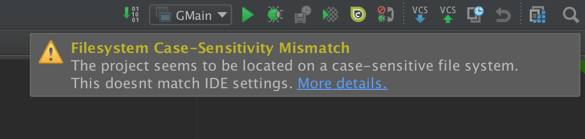

[TOC]


# 说明

作为一个Macbook Pro的老用户，在新年到来之际，狠心给自己买了个大礼物。因为之前使用较久的系统，虽然可以使用系统自带的`迁移助理`进行配置和数据文件传输，但考虑到系统中残留的各种信息比较多，还是决定浪费一点点时间进行重新配置，本文主要为记载重新配置过程中，进行的各种文件安装及操作。针对系统使用过程中的个性化配置，可参照[OSX配置及使用](./osx配置及使用.md)设置说明文档。


## 基本环境配置

新MAC的基本配置信息：

- MacBook Pro 16-inch，2019
- OS：macOS Catalina 10.15.2
- CPU：2.3GHz 八核 Intel Core i9
- 内存：64 GB 2667MHz DDR4
- 磁盘：4TB SSD


考虑到开发过程中，经常需要使用`大小写敏感`的磁盘，这里对磁盘进行重新分区：

- Data：1.5TB，APFS
- Work：2.5TB，Mac OS Extended，Case-sensitive


分区挂载（自动）路径：

```
Data ==> /System/Volumes/Data
Work ==> /Volumes/Work 
```


### 配置 RamDisk

虽然SSD速度比较快，但考虑到毕竟开发过程中会经常牵涉到大量的编译操作，众多的临时文件反复读写还是会影响磁盘寿命；同时，将部分软件的缓存文件放置在内存中，也会提升软件性能，因此，为系统默认配置RamDisk。

具体配置文件及脚本，可参照[osx系统RamDisk配置](./RamDisk/osx系统RamDisk配置.md)文件中的步骤进行。

***当前版本中，Safari缓存如果移动至RamDisk，将无法写入，待解决***


### 个人`SSH`证书备份及恢复

恢复系统中个人证书，证书存放目录为`~/.ssh`,需要注意证书目录的权限为`711`；证书目录中：

- 个人私钥文件权限为600
- 个人公钥文件权限为644
- [使用`config`文件](./osx配置及使用.md#使用config配置SSH)，配置默认服务器所使用的证书文件


如果个人证书（主要是私钥文件）权限不正确，在使用`Git`克隆仓库时，会遇到类似如下的错误提示：

```
Load key "/Users/endial/.ssh/Endial_rsa_git": bad permissions
```


### 系统工具安装

系统工具主要针对使用频度较高或比较基础的应用软件，需要尽早安装：

- NTFS for Mac：为系统增加NTFS写入支持 
- Little Snitch：防火墙软件，用户后续软件破解或屏蔽网络登录 
- Sougo输入法：搜狗中文输入法 
- 1Password：个人密码保存及管理工具
- Bartender：系统状态栏应用图标隐藏工具 


## 基本工具安装


### oh-my-zsh

Catalina系统默认使用ZSH，为了方便使用，安装`oh-my-zsh`配置脚本：

```
sh -c "$(curl -fsSL https://raw.github.com/robbyrussell/oh-my-zsh/master/tools/install.sh)"
```


修改文件`~/.zshrc`，配置个性化主题：

```
ZSH_THEME="robbyrussell"
```

也可以把主题设置成随机，随机到自己喜欢的主题，记下名字再修成那个主题。


重启`Terminal`或运行命令`source ~/.zshrc`使配置立即生效。


### brew

[Brew](http://brew.sh/) 是 Mac 下面的包管理工具，通过 Github 托管适合 Mac 的编译配置以及 Patch，可以方便的安装开发工具。

后续大部分基本工具使用`brew`安装，因此，先安装`homebrew`工具，安装命令可参考[Homebrew官网](https://brew.sh/)指导说明：

```
/usr/bin/ruby -e "$(curl -fsSL https://raw.githubusercontent.com/Homebrew/install/master/install)"
```

对于国内用户访问Github比较慢的问题，可以参照[使用国内源安装Brew](#使用国内源安装Brew)进行安装。


使用`brew`安装的包：

```
brew update
brew install tmux git subversion go upx curl wget dos2unix autoconf automake cmake autojump protobuf protoc-gen-go tree
brew install sshfs
```

- sshfs：用于远程文件系统挂载，需要搭配`osxfuse`，参见[`sshfs.md`](./docs/sshfs.md)
- tmux：终端分屏管理工具
- git：Git协议支持
- subversion：Subversion协议支持
- go：Golang编译器
- upx：可执行文件压缩器
- curl：利用URL规则的命令行下载工具
- wget：利用URL规则的命令行下载工具
- dos2unix：文档格式转换工具
- autoconf/automake/cmake：编译相关
- autojump：oh-my-zsh使用的自动跳转插件
- protobuf：Protobuf协议工具
- protoc-gen-go：针对Golang的Protobuf代码生成工具
- tree：目录树显示工具


#### brew 启动已安装的应用服务

针对已经安装的brew包，可以使用以下命令行方式启动后台服务（如 Redis）：

```
brew services start redis
```


### brew cask

[Brew cask](https://github.com/phinze/homebrew-cask) 是类似 Brew 的管理工具， 直接提供 dmg 级别的二进制包，（Brew 是不带源码，只有对应项目所在的 URL）。


使用`brew cask`安装的包：

```
brew cask install google-chrome iterm2 wechat qq baidunetdisk osxfuse neteasemusic keka alfred cheatsheet shadowsocksx-ng wireshark homebrew/cask-versions/microsoft-remote-desktop-beta  movist mplayerx mpv vlc vlcstreamer smartgit folx typora poedit xld ichm postman skype sublime-text xscope go2shell cLion goland homebrew/cask-versions/adoptopenjdk8
```

- google-chrome：Chrome浏览器
- iterm2：好用的终端软件，完全可以替代系统的Terminal
- alfred：效率工具，必装，完全代替系统的Spotlight
- cheatsheet：效率工具，快捷键提示
- movist：媒体播放工具
- mplayerx：媒体播放工具
- mpv：媒体播放工具
- vlc：媒体播放工具
- vlcstreamer：VLC推流工具
- shadowsocksx-ng：VPN科学上网工具
- wireshark：网络分析工具
- wechat：微信
- qq：QQ
- microsoft-remote-desktop-beta：远程桌面
- baidunetdisk：百度网盘
- osxfuse：OSX上远程文件系统挂载工具，需要搭配`sshfs`，参见[`sshfs.md`](./docs/sshfs.md)
- smartgit：Git图形化工具
- folx：下载工具
- typora：Markdown编辑器
- poedit：PO文件编辑器
- xld：音乐文件转换工具
- neteasemusic：网易云音乐
- ichm：HELP文件浏览工具
- keka：压缩工具
- postman：API调试
- skype：Skype通讯软件
- sublime-text：Sublime Text文编编辑器
- xscope：屏幕测量工具
- go2shell：Finder中集成Shell快捷键
- CLion：C/C++ 开发IDE
- GoLand：Golang 开发IDE
- homebrew/cask-versions/adoptopenjdk8: JDK 8.0


## 日常办公及常用软件

[TODO]

- jxplorer：LDAP管理工具，需要JDK环境支持，[官网下载](https://sourceforge.net/projects/jxplorer/)


## 其他软件安装


### MongoDB安装

因MongoDB软件已经宣布不再开源，因此，该软件已经无法直接使用`brew`进行`MongoDB`的安装，但可以使用`brew`安装该软件的社区版本：

```
brew tap mongodb/brew
brew install mongodb-community
```


## 软件配置及问题解决


### Wireshark 提示`Wireshark: Permission denied`

安装软件后，可能每次启动`Terminal`时，会出现如下的提示错误：

```
Wireshark: Permission denied
```


**问题原因：**

```
This is the case after installing "Add Wireshark to the system PATH" and seems to be a problem in the upstream package. After installation, these two files are not readable and cause the above error:
-rw-------  1 root  wheel  57 Nov 20 18:19 /etc/manpaths.d/Wireshark
-rw-------  1 root  wheel  43 Nov 20 18:19 /etc/paths.d/Wireshark
```


**解决方案：**

```
sudo chmod 644 /etc/manpaths.d/Wireshark /etc/paths.d/Wireshark
```


### ShadowsocksX-NG 闪退

安装`ShadowsocksX-NG`科学上网软件后，发现无法启动，出现软件闪退现象。


问题原因：**

问题出现原因在该软件的[版本描述](https://github.com/shadowsocks/ShadowsocksX-NG/releases)中有说明：

```
Known Issue:
#1185 Would crash in fresh installation. Work around: Make sure the folder ~/.ShadowsocksX-NG exists.
```


解决方案：**

```
mkdir ~/.ShadowsocksX-NG
```


### tree命令显示中文乱码

`brew`安装`tree`后，针对中文显示，会有乱码出现。


**解决方案：**

在`.zshrc`文件中增加相应配置：

```
alias tree="tree -N"
```


### Jetbrains 系列工具提示`Filesystem Case-Sensitivity Mismatch`




问题原因：**

在Mac OSX及Wndows系统中，Jetbrains相关的IDEs默认使用大小写无关选项；如果项目所在磁盘分区为大小写敏感的，则会提示该问题。


**解决方案：**

在IDEA的`idea.properties`配置文件中增加有关选项；进入配置选项方式为相应IDEA的菜单`Help -> Edit Custom Properties`,如果配置文件不存在，按提示创建一个，并在最后增加如下内容：

```
idea.case.sensitive.fs=true
```


## 使用国内源安装Brew

[TODO]
