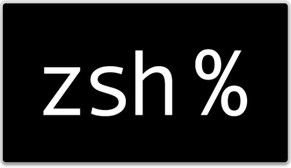
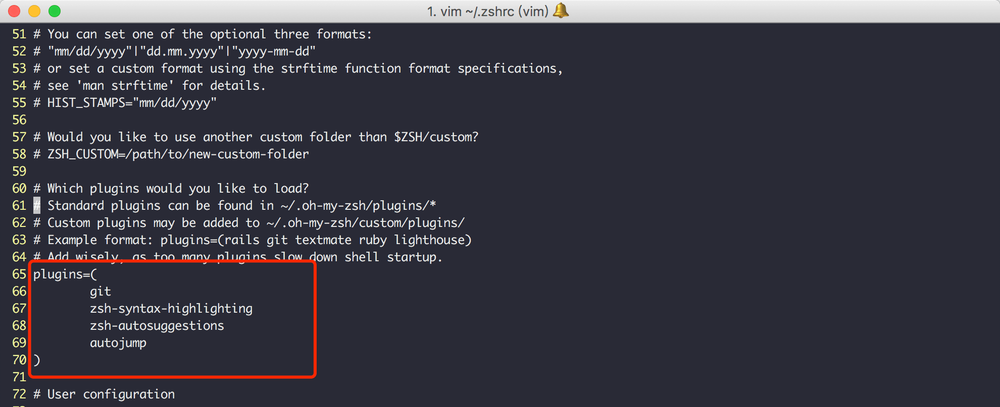
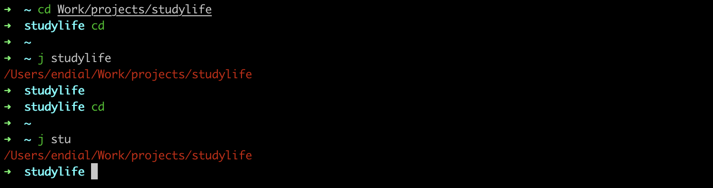
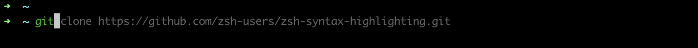
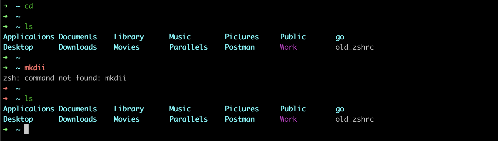

[TOC]




# 说明

目前常用的 Linux 系统和 OS X 系统的默认 Shell 都是 bash，但是真正强大的 Shell 是深藏不露的 zsh， 这货绝对是马车中的跑车，跑车中的飞行车，史称『终极 Shell』，但是由于配置过于复杂，所以初期无人问津，很多人跑过来看看 zsh 的配置指南，什么都不说转身就走了。直到有一天，国外有个穷极无聊的程序员开发出了一个能够让你快速上手的zsh项目，叫做「oh my zsh」，Github 网址是：[https://github.com/robbyrussell/oh-my-zsh](https://link.zhihu.com/?target=https%3A//github.com/robbyrussell/oh-my-zsh)。这玩意就像「X天叫你学会 C++」系列，可以让你神功速成，而且是真的。


## 使用ZSH


### 安装ZSH

- Mac OSX，不用安装，直接进入下一步安装oh-my-zsh好了
- RedHat 系列: `sudo yum install zsh`
- Ubuntu 系列: `sudo apt-get install zsh` 
- Windows: 洗洗睡吧，你没戏了


设置默认Shell为ZSH：`chsh -s /bin/zsh`,根据提示输入当前用户与密码。重新启动终端，就可以使用ZSH了。


### 安装 oh-my-zsh


- 自动安装

```
wget https://github.com/robbyrussell/oh-my-zsh/raw/master/tools/install.sh -O - | sh
```

- 手动安装

```
git clone git://github.com/robbyrussell/oh-my-zsh.git ~/.oh-my-zsh
cp ~/.oh-my-zsh/templates/zshrc.zsh-template ~/.zshrc
```


## 安装插件

插件的启用配置选项，都在`.zshrc`文件的`plugins`配置参数中，可以灵活的更改，针对本文的几个插件，更改效果如下：



配置文件更新后，可以使用`source ~/.zshrc`使配置文件在当前终端生效。


### autojump

autojump 是一个十分便捷的小工具，可以很方便的让我们进入某个目录，而不再输入完整的目录。autojump 自有一个数据库系统，会自动记录你所有进入过的目录，并且会根据你进入某个目录的频率，分配相应的权重。



zsh 和 autojump 的组合形成了 zsh 下最强悍的使用组合，可以使用如下方式安装：

- Mac OSX

```
brew install autojump
```

- Linux：

下载软件包（可以下载最新的版本）：

```
wget https://github.com/downloads/joelthelion/autojump/autojump_v21.1.2.tar.gz
```

解压缩并切换至相应目录：

```
tar zxvf autojump_v21.1.2.tar.gz | cd
```

执行安装脚本：

```
./install.sh
```

修改配置文件`.zshrc`,启用插件：

```
plugins=(
	...
	autojump
)
```

重新启动一个新的终端，则autojump插件已经生效。

> 注意：
>
> 只有进入过的目录才会有记录
>
> 路径跳转错误可以使用 `autojump --purge` 来清理错误路径


比如你进入过 `/home/endial/work/blog` 这个目录，那么下次我们要想进入这个目录的时候，不必再输入完整的路劲了，只需要一个简单的命令:

```python
j blog
```

甚至你还可以:

```python
j bl
```

更加变态的是，你还可以:

```python
j b
```

如果同时存在多个包含 `b` 的目录，那么 autojump 会根据你的权重进入你访问最频繁的那个目录，比如你的项目目录 `blog`


### zsh-autosuggestions

使用`zsh-autosuggestions`插件后，输入命令时可提示自动补全（灰色部分），然后按键盘 → 即可补全（[详细介绍](https://github.com/zsh-users/zsh-autosuggestions)）。



安装插件：

```
git clone git://github.com/zsh-users/zsh-autosuggestions ~/.oh-my-zsh/plugins/zsh-autosuggestions
```

修改配置文件`.zshrc`，启用插件：

```
plugins=(
	...
	zsh-autosuggestions
)
```

重新启动一个新的终端，则`zsh-autosuggestions`插件已经生效。


可以为zsh-autosuggestions增加一个特殊的别名，修改配置文件`.zshrc`，并在最后增加：

```
bindkey '^z' autosuggest-execute
```

> 如果看不到颜色变化，可能是字体颜色设置太淡，可以设置：`ZSH_AUTOSUGGEST_HIGHLIGHT_STYLE='fg=10'`


### zsh-syntax-highlighting

使用`zsh-syntax-highlighting`插件后，日常用的命令会高亮显示，命令错误显示红色，如下图（[详细介绍](https://github.com/zsh-users/zsh-syntax-highlighting)）。



安装插件：

```
git clone https://github.com/zsh-users/zsh-syntax-highlighting.git ~/.oh-my-zsh/plugins/zsh-syntax-highlighting
```

修改配置文件`.zshrc`，启用插件：

```
plugins=(
	...
	zsh-syntax-highlighting
)
```

重新启动一个新的终端，则`zsh-syntax-highlighting`插件已经生效。


## 使用技巧

1. 兼容Bash：原来使用bash的用户切换过来毫无压力
2. 智能拼写纠正：输入gtep mactalk * -R，系统会提示：zsh: correct ‘gtep’ to ‘grep’ [nyae]?
3. 自动补全：各种自动补全，路径补全、命令补全、命令参数补全、插件内容补全等等。触发补全只需要按一下或两下 tab 键，补全项可以使用 ctrl+n/p/f/b上下左右切换。比如你想杀掉 java 的进程，只需要输入 kill java + tab键，如果只有一个 java 进程，zsh 会自动替换为进程的 pid，如果有多个则会出现选择项供你选择。ssh + 空格 + 两个tab键，zsh会列出所有访问过的主机和用户名进行补全
4. 智能跳转：安装了autojump之后，zsh 会自动记录你访问过的目录，通过 j + 目录名 可以直接进行目录跳转，而且目录名支持模糊匹配和自动补全，例如你访问过hadoop-1.0.0目录，输入j hado 即可正确跳转。j –stat 可以看你的历史路径库
5. 目录浏览和跳转：输入 d，即可列出你在这个会话里访问的目录列表，输入列表前的序号，即可直接跳转
6. 在当前目录下输入 .. 或 … ，或直接输入当前目录名都可以跳转，你甚至不再需要输入 cd 命令了
7. 通配符搜索：ls -l **/*.sh，可以递归显示当前目录下的 shell 文件，文件少时可以代替 find，文件太多就歇菜了
8. 更强的别名，参考[ZSH配置文件参考](#ZSH配置文件参考)章节


### 修改主题

oh-my-zsh的主题配置在文件`.zshrc`中：

```
ZSH_THEME="robbyrussell"
```

可以修改为：

```
ys //我在用
avit //还不错
Candy //...
bira //....
random //随机，可以用来体验各种不同的主题
```

可以在这个网址看下相关主题的预览：[https://github.com/robbyrussell/oh-my-zsh/wiki/External-themes](https://github.com/robbyrussell/oh-my-zsh/wiki/External-themes)


## ZSH配置文件参考

常用`alias`配置：

```

```


ZSH插件设置：

```
plugins=(
	zsh_reload
  git
  osx
  brew
  brew-cask
  colored-man-pages
  sudo
  autojump
  zsh-autosuggestions
  zsh-syntax-highlighting
)
```

- zsh_reload：这个增加了一个src的alias，可以重新reload zsh，尤其是当一个新的程序安装，zsh并不能像bash那样立马可以识别新的命令
- autojump：配合autojump 使用 j 命令直接快速进入某个目录
- zsh-syntax-highlighting，这个是当你正在输入一个命令的时候，显示绿色，表示这个命令是有效的存在的，显示红色表示这个命令在系统中不存在，当然不止这些。
- brew / brew-cask：这两个是给OS X 的brew增加补全的。非这个系统请写成 !brew-cask !brew
- colored-man-pages：顾名思义，彩色的man很赞！
- sudo：当你输入一个命令发现需要root权限，通常只能按方向上键，然后光标移到头部，加入sudo，但是有了这个插件，不用再移动光标到头部了，直接两下 ESC， sudo就会自动加入到最前面。。。
- zsh-autosuggestions：命令行自动建议

  


